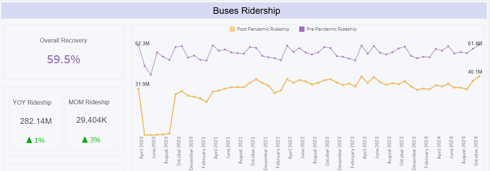
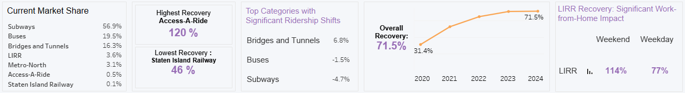

# MTA Ridership Recovery Dashboard

## Project Overview
This project analyzes and visualizes ridership recovery trends for the Metropolitan Transportation Authority (MTA) post-pandemic. It explores how COVID-19 impacted transportation behaviors and provides actionable insights to guide recovery strategies.

## Stakeholder-Centric Approach
This dashboard addresses the MTA’s key concerns by aligning with stakeholder priorities:

<a href="https://public.tableau.com/views/MavenCommuterChallengeNov302024/MainV2" 
   style="color: #FFD700; text-decoration: none; font-weight: bold; font-size: 16px;">
   Explore the Dashboard on Tableau Public
</a>

- **Identifying Ridership Trends**: Monitoring recovery across transportation modes.  
  

- **Highlighting Key Insights**: Examining market share shifts, weekday vs. weekend patterns, and overall recovery rates.
 

- **Supporting Decision-Making**: Offering insights to inform strategies amidst hybrid work trends.

### Approach Details:
- **Stakeholder Priorities**: Focused on recovery rates, market share changes, and category trends.  
- **Decision-Making Needs**: Incorporated weekday vs. weekend trends to reflect evolving commuter behavior.  
- **Success Criteria**: Defined objectives to track recovery and pinpoint areas needing improvement.  
- **Organizational Alignment**: Ensured the dashboard supports MTA’s strategic recovery goals.

## Dashboard Features

### Dynamic Visualizations
- Interactive charts and graphs to explore ridership recovery across time periods, categories, and pandemic phases.

### Key Insights
- **Year-over-Year (YoY) and Month-over-Month (MoM) Recovery**: Measuring ridership growth.  
- **Market Share Changes**: Tracking commuter shifts between transportation categories.  
- **Category Highlights**:  
  - Access-A-Ride leads recovery with 120%.  
  - Subways face challenges with a 4.7% loss in market share due to reduced weekday demand.  
  - Staten Island Railway lags at 46% recovery.

### Professional Design
- A clean, user-friendly layout highlights actionable insights for decision-makers.

## Key Findings
- **Hybrid Work Impact**: WFH policies significantly affect weekday recovery rates.  
- **Shifting Patterns**: Weekend ridership recovers faster than weekday usage in key modes.  
- **Category Leadership**: Bridges and Tunnels achieved a 100.8% recovery, showcasing increased reliance on personal vehicles.

## Conclusion
This project demonstrates the power of aligning data visualization with stakeholder priorities. The dashboard identifies key challenges and opportunities to optimize transit strategies in the post-pandemic era.
